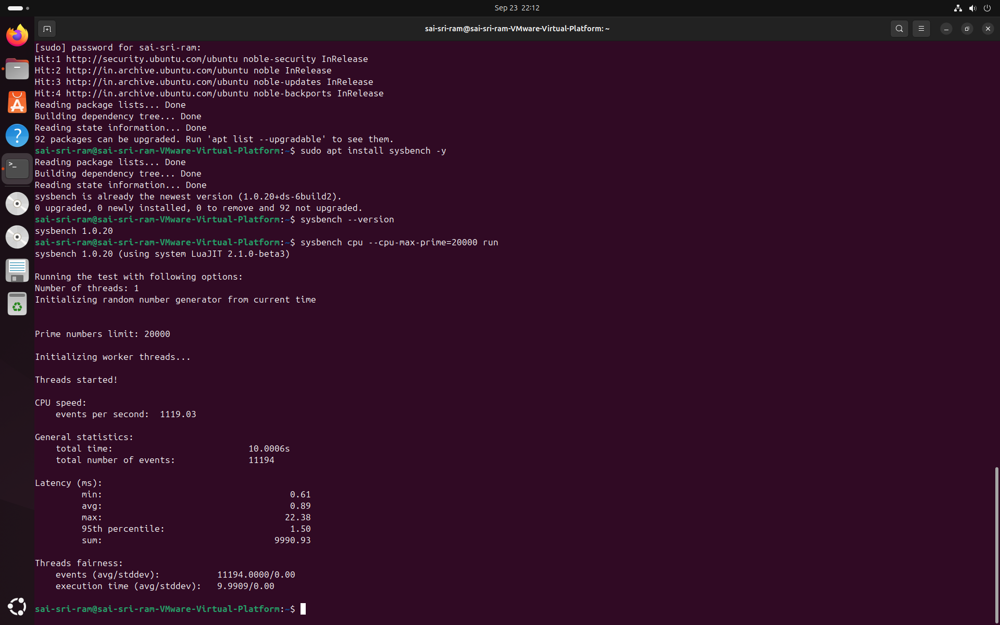

# Cloud Computing Lab Report

## Experiment 1 — Performance Analysis of Type-1 and Type-2 Hypervisors

### Aim

To compare the CPU performance of a Type-1 hypervisor and a Type-2 hypervisor using Ubuntu virtual machines and the `sysbench` CPU benchmark.

## Hypervisors

| Part | Hypervisor | Type | Role |
|---|---|---|---|
| Part-A | Proxmox VE | Type-1 | Bare-metal virtualization |
| Part-B | VMware Workstation | Type-2 | Hosted virtualization |

## Benchmark

```bash
sysbench cpu --cpu-max-prime=20000 run
```

## System Verification

```bash
hostnamectl
lscpu
free -h
df -h
top
```

## Observations

| Metric | Proxmox VE | VMware Workstation |
|---|---:|---:|
| CPU throughput | 1749.16 events/sec | 1119.03 events/sec |
| Total time | 10.0005 sec | 10.0006 sec |
| Total events | 17,494 | 11,194 |
| Minimum latency | 0.57 ms | 0.61 ms |
| Average latency | 0.57 ms | 0.89 ms |
| 95th percentile | 0.58 ms | 1.50 ms |
| Maximum latency | 2.43 ms | 22.38 ms |

## Analysis

The Proxmox VE run completed 17,494 events in approximately ten seconds, compared with 11,194 events for VMware Workstation.

The measured throughput advantage was:

**56.31%**

Average latency was also lower in the Proxmox run:

**0.57 ms vs 0.89 ms**

The maximum latency was significantly lower for Proxmox:

**2.43 ms vs 22.38 ms**

These observations indicate that the Type-1 environment provided better CPU throughput and more stable latency for this particular workload and configuration.

## Evidence

### Part-A — Proxmox VE


### Part-B — VMware Workstation



## Performance Overview


## Conclusion

The experiment demonstrates that the Type-1 Proxmox VE environment produced better CPU benchmark results than the Type-2 VMware Workstation environment under the tested configuration.

Type-1 virtualization is generally appropriate for infrastructure and production-oriented cloud environments, while Type-2 virtualization remains useful for desktop development, learning, testing, and laboratory work.
