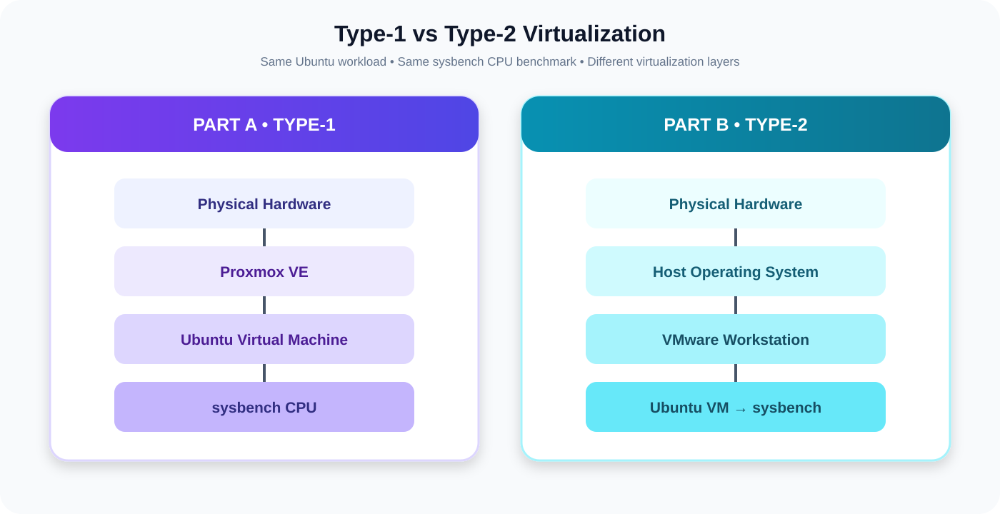
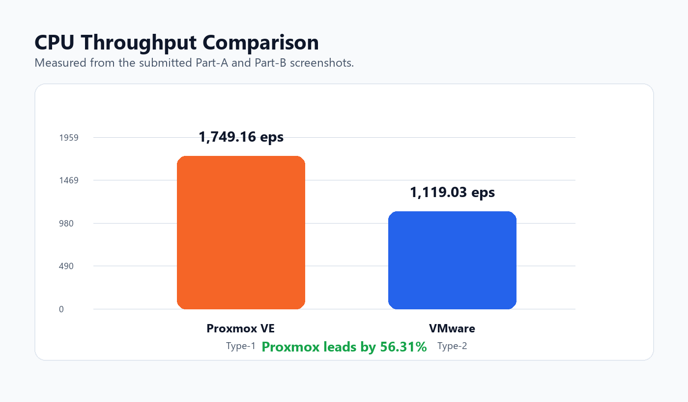
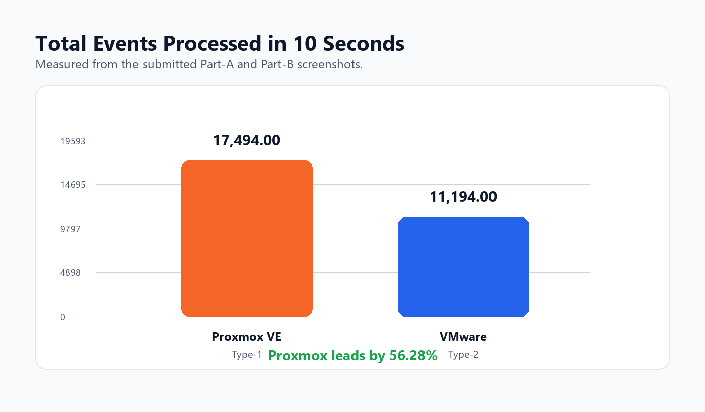
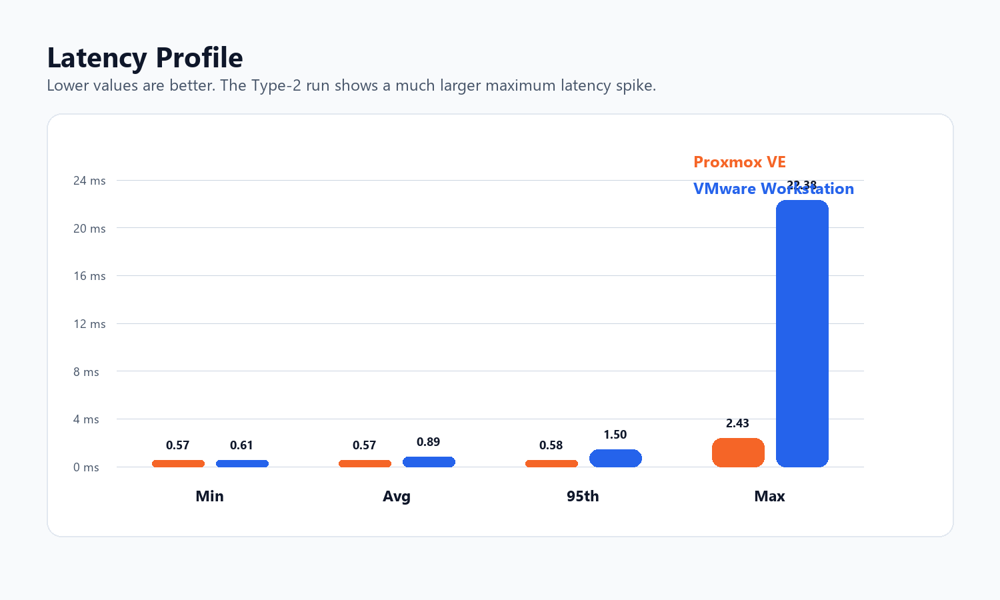
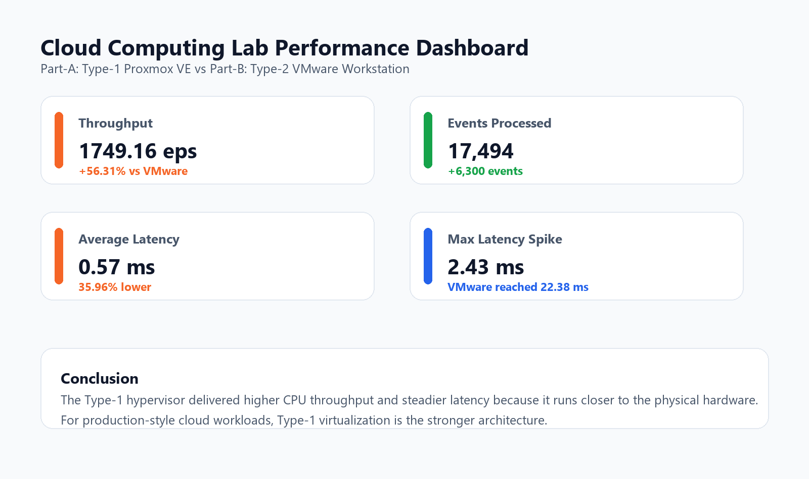

# ☁️ Cloud Computing Lab — Experiment 1

<div align="center">

## Type-1 vs Type-2 Hypervisor Performance

**Proxmox VE** compared with **VMware Workstation** using the same Ubuntu + `sysbench` CPU workload.


</div>

---

## 🎯 Aim

To compare the CPU performance of a **Type-1 bare-metal hypervisor** and a **Type-2 hosted hypervisor** using equivalent Ubuntu virtual-machine workloads.

### What is compared?

| Part | Hypervisor | Type |
|---|---|---|
| **A** | Proxmox VE | Type-1 / Bare-metal |
| **B** | VMware Workstation | Type-2 / Hosted |

---

## 🧩 Architecture



### Type-1

```text
Physical Hardware
       ↓
   Proxmox VE
       ↓
   Ubuntu VM
       ↓
   sysbench CPU
```

### Type-2

```text
Physical Hardware
       ↓
Host Operating System
       ↓
VMware Workstation
       ↓
Ubuntu VM
       ↓
sysbench CPU
```

---

## 🛠️ Common Test Configuration

| Parameter | Configuration |
|---|---|
| Guest OS | Ubuntu |
| Benchmark | sysbench 1.0.20 |
| CPU workload | Prime calculation |
| Prime limit | 20,000 |
| Test duration | ~10 seconds |
| Main metric | Events per second |
| Secondary metrics | Events, latency, resource usage |

The same benchmark command was used in both environments:

```bash
sysbench cpu --cpu-max-prime=20000 run
```

---

# 🟣 Part A — Proxmox VE

Proxmox VE is used as the **Type-1 hypervisor**. The Ubuntu VM is created and executed directly through the bare-metal virtualization layer.

### Evidence sequence

1. Proxmox dashboard
2. VM configuration
3. Running virtual machine
4. Ubuntu console
5. System configuration
6. sysbench benchmark
7. Resource monitoring

image_group{"layout":"carousel","aspect_ratio":"16:9","query":["Proxmox VE dashboard virtual machine","Proxmox virtual machine Ubuntu console"],"num_per_query":1}

Detailed screenshots are stored in:

`images/part-a-proxmox/`

---

# 🔵 Part B — VMware Workstation

VMware Workstation is used as the **Type-2 hypervisor**. The virtualization layer runs above the host operating system.

### Evidence sequence

1. New VM wizard
2. 20 GB virtual disk
3. RAM configuration
4. CPU configuration
5. Ubuntu desktop
6. `hostnamectl`
7. `lscpu`
8. `free -h`
9. `df -h`
10. `top`
11. sysbench installation/version
12. CPU benchmark
13. Final comparison

Detailed screenshots are stored in:

`images/part-b-vmware/`

---

# 📊 Benchmark Results

| Metric | Proxmox VE | VMware Workstation | Observation |
|---|---:|---:|---|
| CPU throughput | **1749.16 events/sec** | 1119.03 events/sec | Proxmox +56.31% |
| Total time | 10.0005 s | 10.0006 s | Nearly equal |
| Total events | **17,494** | 11,194 | Proxmox +6,300 |
| Minimum latency | **0.57 ms** | 0.61 ms | Proxmox lower |
| Average latency | **0.57 ms** | 0.89 ms | Proxmox 35.96% lower |
| 95th percentile | **0.58 ms** | 1.50 ms | Proxmox more consistent |
| Maximum latency | **2.43 ms** | 22.38 ms | VMware had larger spike |

---

## 📈 Visual Analysis

### CPU Throughput



### Events Processed



### Latency



### Performance Overview



---

# 🔬 Technical Discussion

### Why did Proxmox perform better?

A Type-1 hypervisor operates closer to the physical hardware and does not depend on a general-purpose desktop host OS for the primary virtualization path. In this experiment, that produced higher CPU throughput and lower latency.

### Why was VMware different?

VMware Workstation operates above a host operating system. The guest therefore shares host scheduling and system resources, which can introduce additional overhead and latency variation.

> **Important:** These results describe this particular lab configuration. Hypervisor performance can change with CPU allocation, host load, virtualization settings, storage, and workload type.

---

# 📸 Screenshot Evidence

## Part A — Proxmox VE

| Step | Evidence |
|---|---|
| Dashboard | `01-proxmox-dashboard.png` |
| VM configuration | `02-proxmox-vm-configuration.png` |
| VM running | `03-proxmox-vm-running.png` |
| Ubuntu console | `04-proxmox-ubuntu-console.png` |
| System configuration | `05-proxmox-system-configuration.png` |
| sysbench | `06-proxmox-sysbench-result.png` |
| Resource monitoring | `07-proxmox-resource-monitoring_1–4.png` |

## Part B — VMware Workstation

| Step | Evidence |
|---|---|
| VM wizard | `01_VMware_New_VM_Wizard.png.png` |
| Disk | `02_VMware_Disk_20GB.png.png` |
| RAM | `03_VMware_RAM_Configuration.png.png` |
| CPU | `04_VMware_CPU_Configuration.png.png` |
| Ubuntu | `05_Ubuntu_VM_Desktop.png.png` |
| hostnamectl | `06_hostnamectl.png.png` |
| lscpu | `07_lscpu.png.png` |
| free -h | `08_free_h.png.png` |
| df -h | `09_df_h.png.png` |
| top | `10_top.png.png` |
| sysbench setup | `11_Sysbench_Installation_Version.png.png` |
| benchmark | `12_Sysbench_CPU_Benchmark.png.png` |
| final comparison | `13.final answer.png` |

---

# 🧪 Reproduce the Experiment

Install sysbench:

```bash
sudo apt update
sudo apt install sysbench -y
```

Verify:

```bash
sysbench --version
```

Run:

```bash
sysbench cpu --cpu-max-prime=20000 run
```

Verify system configuration:

```bash
hostnamectl
lscpu
free -h
df -h
top
```

---

# 🗂️ Repository Structure

```text
EXP-1/
├── README.md
├── LAB_REPORT.md
├── images/
│   ├── architecture-comparison.svg
│   ├── charts/
│   │   ├── cpu-throughput.png
│   │   ├── events-processed.png
│   │   ├── latency-analysis.png
│   │   └── performance-overview.png
│   ├── part-a-proxmox/
│   └── part-b-vmware/
└── scripts/
    └── generate_charts.py
```

---

# 📝 Result

The experiment shows that, under the measured configuration, **Proxmox VE Type-1 achieved higher CPU throughput and lower latency than VMware Workstation Type-2**.

### Key result

**1749.16 events/sec vs 1119.03 events/sec**

That corresponds to a **56.31% throughput advantage** for the Proxmox VE run.

---

<div align="center">

### Cloud Computing Laboratory • Experiment 1

**Virtualization Performance Analysis**

</div>
